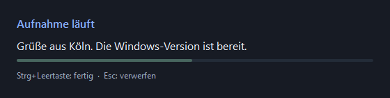

# Lautschrift

**Local, fully offline speech-to-text dictation for Linux / Wayland, Windows and macOS.**
Press a hotkey, speak, press again — the text is pasted into whatever field
has focus, system-wide, in any app. No cloud, no API keys, no telemetry.

*„Lautschrift" is German for phonetic transcription — literally „sound-writing".*

Powered by **NVIDIA Parakeet TDT 0.6B v3** (25 European languages, automatic
language detection) running on the CPU via [`sherpa-onnx`](https://github.com/k2-fsa/sherpa-onnx)
(ONNX, int8).

## macOS

Die native Mac-Version nutzt dieselbe Offline-Spracherkennung mit einem
systemweiten Hotkey (CGEventTap), Mikrofonaufnahme über PortAudio/CoreAudio,
Einfügen per Cmd+V und einem Menüleistensymbol (Qt). Apple Silicon und Intel.

### Installation und Start

macOS 13+, Python 3.12 oder 3.13 (z. B. `brew install python@3.13`) und ein Mikrofon.

```bash
git clone https://github.com/ingoross/lautschrift.git && cd lautschrift
./install-mac.sh              # venv, Pakete aus requirements-mac.txt, Modell (~465 MB)
./start-mac.sh                # manuell starten, oder:
./install-mac.sh --service    # Autostart per launchd-Agent (de.unfuture.lautschrift)
```

Beim ersten Start fragt macOS nach Berechtigungen für **Python** unter
*Systemeinstellungen → Datenschutz & Sicherheit*: **Bedienungshilfen** (Hotkey und
Einfügen), ggf. **Eingabeüberwachung** und **Mikrofon**. Nach dem Erteilen neu starten.
Bei Start aus einem Terminal wird die Mikrofonfreigabe dem Terminal zugeordnet.

### Bedienung

- **Option+Leertaste (⌥ Space):** Aufnahme starten, erneut drücken zum Erkennen und
  Einfügen. Die Tastenkombination wird abgefangen, es landet kein geschütztes Leerzeichen im Text.
- **Esc:** laufende Aufnahme oder ausstehende Erkennung verwerfen.
- **Menüleistensymbol:** Status, Aufnahme, Abbruch, Einfügetastenkombination, Beenden.
- Start-/Stopp-Ton, Live-Overlay mit Pegellinie, Auto-Stopp nach 120 Sekunden und
  Verhalten bei App-Wechsel wie in der Windows-Version.

Standardmäßig wird **Cmd+V** eingefügt; für Terminals mit abweichender Belegung
kann **Cmd+Umschalt+V** gewählt werden (`LAUT_PASTE_KEY=cmd+shift+v`).

### Einstellungen und Diagnose

`LAUT_MODEL_DIR`, `LAUT_THREADS`, `LAUT_DECODE_INTERVAL`, `LAUT_TRAILING_SPACE`,
`LAUT_PASTE_KEY`, `LAUT_INPUT_DEVICE`, `LAUT_SOUND_START` / `LAUT_SOUND_STOP`
gelten wie unter Windows. Der Mac nutzt standardmäßig die leiseren Töne `sounds/*-soft.wav`. Log: `~/Library/Application Support/Lautschrift/lautschrift.log`.

```bash
.venv/bin/python lautschrift_mac.py --list-devices
.venv/bin/python lautschrift_mac.py --check      # Modell, Mikrofon, Bedienungshilfen-Freigabe
.venv/bin/python -m unittest discover -s tests -p test_mac.py -v
```

Fehlersuche:
- **Hotkey reagiert nicht** — Bedienungshilfen-Freigabe für Python prüfen; außerdem
  hängendes *Secure Keyboard Entry* (z. B. Ghostty, Terminal) blockiert alle
  Event-Taps: `ioreg -l -d 1 -w 0 | grep -o 'kCGSSessionSecureInputPID"=[0-9]*'` muss leer sein.
- **Andere Diktat-Apps** (FluidVoice, superwhisper) mit derselben Tastenkombination
  vorher beenden oder umbelegen, sonst reagieren beide.
- **Text nur in der Zwischenablage** — Einfügen wurde blockiert oder während der
  Erkennung wurde die App gewechselt; manuell mit Cmd+V einfügen.

## Windows

Die native Windows-Version verwendet dieselbe Offline-Spracherkennung, mit
Windows-Hotkeys, Mikrofonaufnahme über PortAudio und einer Qt-Oberfläche.
Linux bleibt über `lautschrift.py` und `install.sh` verfügbar; die folgenden
Linux-Abschnitte beschreiben weiterhin diese Variante.



### Installation und Start

Windows 10/11 x64, Python 3.12 oder 3.13 (64 Bit) und ein Mikrofon werden benötigt.
Git installieren und in PowerShell ausführen (bei vorhandenem Klon direkt
in dessen Projektordner wechseln):

```powershell
git clone https://github.com/ingoross/lautschrift.git
cd lautschrift
powershell -NoProfile -ExecutionPolicy Bypass -File .\install-windows.ps1
.\start-windows.cmd
```

Das Setup erstellt `.venv`, installiert die Pakete aus `requirements-windows.txt`
und lädt einmalig das Parakeet-Modell (~465 MB). Danach arbeitet das Diktat offline.
Bei einem Python außerhalb des Suchpfads: `-Python C:\Pfad\python.exe` angeben.
Ein bestehendes Modell wird wiederverwendet. Administratorrechte sind nicht nötig.

### Bedienung

- **Strg+Leertaste:** Aufnahme starten, erneut drücken zum Erkennen und Einfügen.
- Ein kurzer aufsteigender Ton bestätigt den Aufnahmebeginn; ein absteigender
  Ton bestätigt das Aufnahmeende, bevor der Text fertig erkannt und eingefügt wird.
- **Copilot-Taste / F23:** ebenfalls verfügbar, sofern Windows die Tastenkombination freigibt.
- **Esc:** laufende Aufnahme oder ausstehende Erkennung verwerfen; die Zwischenablage bleibt unverändert.
- **Taskleistensymbol:** Status, Aufnahme, Abbruch, Einfügetastenkombination und Beenden.
- Das Live-Overlay bleibt im Vordergrund, ohne den Tastaturfokus zu übernehmen.
- Eine schmale, geglättete Pegellinie zeigt das Mikrofonsignal ohne wechselnde Zahlen; bei sehr schwachem
  Eingangssignal und leerem Erkennungsergebnis erscheint ein Hinweis zur Mikrofonprüfung.
- Nach maximal 120 Sekunden wird eine Aufnahme automatisch beendet und erkannt.
- Bei einem Fensterwechsel während des Diktats wird der Text nur kopiert;
  eine Meldung weist auf manuelles Einfügen hin.

Standardmäßig wird **Strg+V** zum Einfügen verwendet. Im Menü kann für Terminals
**Strg+Umschalt+V** oder **Umschalt+Einfügen** gewählt werden. Windows kann das
Einfügen in Programme mit höheren Rechten blockieren; dann manuell einfügen.
Nicht jede Zielanwendung unterstützt jede Tastenkombination.

### Einstellungen und Diagnose

Die Windows-Version berücksichtigt `LAUT_MODEL_DIR`, `LAUT_THREADS`,
`LAUT_DECODE_INTERVAL`, `LAUT_TRAILING_SPACE` und `LAUT_PASTE_KEY`.
`LAUT_INPUT_DEVICE` wählt eine Mikrofon-ID oder einen eindeutigen Gerätenamen.
Diese Variablen vor dem Start in PowerShell setzen, zum Beispiel:

```powershell
.\.venv\Scripts\python.exe lautschrift_windows.py --list-devices
$env:LAUT_INPUT_DEVICE = '1'
$env:LAUT_PASTE_KEY = 'ctrl+v'
.\start-windows.cmd
```

Ohne Geräteauswahl wird das Windows-Standardmikrofon verwendet. Falls ein
Audiotreiber das Öffnen verweigert, werden die Standard-Eingänge der anderen
Windows-Audioschnittstellen versucht. Mikrofonzugriff
für Desktop-Apps muss in den Windows-Datenschutzeinstellungen erlaubt sein.
Die Aufnahme bleibt im RAM; Diktattexte werden nicht in die Logdatei geschrieben.
Fehlerprotokoll: `%LOCALAPPDATA%\Lautschrift\lautschrift.log`.

```powershell
# Modell laden und Audioeinstellungen prüfen, ohne aufzunehmen:
.\.venv\Scripts\python.exe lautschrift_windows.py --check
# Tests für Abbruch, Einfügen, Fensterwechsel und Fehlerbehandlung:
.\.venv\Scripts\python.exe -m unittest discover -s tests -p test_windows.py -v
```

Die Windows-Variante startet derzeit über Python, nicht als eigenständiges EXE-Paket.
Ein Autostart wird nicht automatisch eingerichtet. `LAUT_TRIGGER_CODE` gilt nur für Linux.
`LAUT_SOUND_START` und `LAUT_SOUND_STOP` können unter Windows eigene WAV-Dateien
angeben; eine leere Zeichenfolge deaktiviert den jeweiligen Ton. Die mitgelieferten
Töne benötigen kein aktiviertes Windows-Systemklangschema.

Technische Referenzen: [sherpa-onnx Python / Windows](https://github.com/k2-fsa/sherpa/blob/master/docs/source/onnx/python/install.rst),
[PortAudio-Installation unter Windows](https://github.com/spatialaudio/python-sounddevice/blob/master/doc/installation.rst),
[Windows-Hotkeys](https://learn.microsoft.com/en-us/windows/win32/api/winuser/nf-winuser-registerhotkey),
[Windows-Eingabesimulation](https://learn.microsoft.com/en-us/windows/win32/api/winuser/nf-winuser-sendinput).

## How it works

**Hotkey** → recording starts, a live overlay shows the text as you speak →
**hotkey again** → recording stops, the final text lands in the clipboard and
is pasted into the currently focused field.

Press **Escape** to cancel a recording or pending transcription. The overlay
closes and the text is discarded, leaving the clipboard untouched. Escape
is observed globally and still reaches the focused application.
The overlay stays above normal windows without taking keyboard focus.

The default hotkey is the **Copilot key** (it sends `Meta+Shift+F23`; we
trigger on `KEY_F23`, code 193). Any key works — see
[Configuration](#configuration).

## Supported systems

| Component | Requirement |
|---|---|
| Display server | **Wayland** (GNOME, KDE Plasma, Sway/Hyprland, …) — X11 is not supported |
| Audio | PipeWire (`pw-record`) or PulseAudio (`parecord`) |
| Autostart (optional) | systemd user session |
| Python | 3.10+ |

Developed and tested on **Fedora (GNOME)**. `install.sh` also knows the
package names for **Debian/Ubuntu (apt)**, **Arch (pacman)** and
**openSUSE (zypper)** — reports and PRs for other distros are welcome.

## Install

```bash
git clone https://github.com/ingoross/lautschrift.git && cd lautschrift
./install.sh              # system packages, permissions, venv, model (~465 MB)
```

If the script just added you to the `input` group, **log out and back in
once**, then:

```bash
.venv/bin/python lautschrift.py     # run manually, or:
./install.sh --service              # enable autostart (systemd user service)
journalctl --user -u lautschrift -f # logs
```

<details>
<summary>Manual installation (any distro)</summary>

1. Install: `wl-clipboard`, `ydotool`, PipeWire CLI tools (`pw-record`/`pw-play`)
   or PulseAudio utils, GTK3 + PyGObject, XWayland, a freedesktop sound theme.
2. Put your user in the `input` group (evdev hotkey):
   `sudo usermod -aG input "$USER"` — then re-login.
3. Make `/dev/uinput` writable for the `input` group (ydotool paste injection):
   ```
   echo 'KERNEL=="uinput", GROUP="input", MODE="0660", OPTIONS+="static_node=uinput"' \
     | sudo tee /etc/udev/rules.d/80-lautschrift-uinput.rules
   sudo udevadm control --reload-rules && sudo udevadm trigger /dev/uinput
   ```
4. Create the venv **with** `--system-site-packages` (so the distro's
   PyGObject is visible) and install `requirements.txt`.
5. `./scripts/download-model.sh`

</details>

## Configuration

Environment variables (e.g. in the systemd unit):

| Variable | Default | Purpose |
|---|---|---|
| `LAUT_TRIGGER_CODE` | `193` (F23) | evdev keycode of the hotkey — find yours with `detect_key.py` |
| `LAUT_PASTE_KEY` | `paste` | insert key: `paste` (dedicated Paste key — works in terminals *and* GUI, no TUI grabs it), `ctrl+shift+v` (terminals), or `ctrl+v` (GUI only; terminal TUIs like Codex hijack it) |
| `LAUT_THREADS` | `6` | CPU threads for inference |
| `LAUT_DECODE_INTERVAL` | `0.8` | seconds between live-overlay updates |
| `LAUT_TRAILING_SPACE` | `1` | append a space (for continued dictation) |
| `LAUT_MODEL_DIR` | `models/parakeet-v3` | model location |
| `LAUT_SOUND_START` / `LAUT_SOUND_STOP` | freedesktop sounds | start/stop jingles (empty = silent) |

## Design notes

Why these building blocks — the hard parts of system-wide Wayland dictation:

| Task | Solution | Why |
|---|---|---|
| STT | Parakeet TDT v3 via `sherpa-onnx` | excellent multilingual quality, runs on CPU |
| Microphone | `pw-record` (fallback: `parecord`) | native on every modern distro |
| Global hotkey | `evdev` (group `input`) | works OS-wide, independent of the compositor |
| Text insertion | clipboard + `ydotool` paste | GNOME offers no `virtual-keyboard` protocol (wtype fails); `ydotool type` mangles non-US layouts (umlauts, y/z) → paste raw keycodes `Ctrl+V` instead, layout-independent |
| Overlay | GTK3 window via XWayland | Keep-above and no keyboard focus; GNOME has no `layer-shell` |

## Helper scripts

- `detect_key.py` — shows evdev keycodes, to find your hotkey's code
- `lautschrift_cli.py` — minimal toggle variant without overlay/daemon; bind
  it to a compositor shortcut instead of using the evdev hotkey. Types via
  `wtype` (works on Sway/Hyprland, **not** on GNOME — use the daemon there).

## Troubleshooting

- **Nothing is pasted, text only in clipboard** — ydotool cannot reach
  `/dev/uinput`. Run `install.sh` (installs the udev rule) and re-login. (If
  `ydotoold` had died leaving a stale socket, Lautschrift now detects that and
  respawns it automatically.)
- **A TUI (e.g. Codex CLI) errors with *"Failed to paste image: no image on
  clipboard"*** — it binds `ctrl+v` to image paste. The default `paste` key
  avoids this; if you overrode `LAUT_PASTE_KEY=ctrl+v`, switch back to `paste`
  (or `ctrl+shift+v`).
- **Hotkey does not fire** — are you in the `input` group (`id -nG`)? Is the
  keycode right? Check with `.venv/bin/python detect_key.py`.
- **No `gi` module** — the venv was created without `--system-site-packages`,
  or PyGObject/GTK4 system packages are missing.

## Limitations

- No true streaming: the offline Parakeet model re-decodes the running
  buffer periodically (feels live, but slows down on very long dictations).
- The overlay requires XWayland (`DISPLAY`) and GTK3. Clipboard and text
  insertion still require a Wayland session.
- Wayland only — on X11 sessions, clipboard and paste injection are not wired up.

## License & attribution

- Code: [MIT](LICENSE) © 2026 Unfuture GmbH
- Speech model: [NVIDIA Parakeet TDT 0.6B v3](https://huggingface.co/nvidia/parakeet-tdt-0.6b-v3),
  licensed [CC-BY-4.0](https://creativecommons.org/licenses/by/4.0/) —
  © NVIDIA Corporation. The int8 ONNX conversion is provided by the
  [k2-fsa/sherpa-onnx](https://github.com/k2-fsa/sherpa-onnx) project
  (Apache-2.0). The model is downloaded at install time, not bundled.
- Inspired by [FluidVoice](https://github.com/altic-dev/FluidVoice) (macOS) —
  Lautschrift is an independent implementation for Linux and shares no code
  with it.
